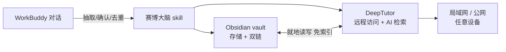

# 🧠 赛博大脑 · WorkBuddy Skills

> 把 WorkBuddy 对话变成你的外置赛博大脑——知识自动沉淀、双链成网、远程访问、AI 增强。

一组 [WorkBuddy](https://www.workbuddy.cn) 技能包。首个核心技能 **赛博大脑（knowledge-vault）** 让你的"对话记忆"不再聊完就散：自动把对话里的核心知识、习惯、技能、资料整理成 Obsidian 双链笔记，经 DeepTutor 实现远程访问与 AI 检索，每条带署名追溯。

## 赛博大脑能做什么

- **自动沉淀** — 对话中识别有价值的内容，确认后整理入库，不用手动记
- **双链成网** — 笔记用 `[[双链]]` 互连，治"内容孤立、连不成体系"
- **远程访问** — 局域网/公网随时访问，任何设备开浏览器就能用
- **AI 增强** — DeepTutor 就地读 vault，问答/辅导/出题基于你的真实笔记
- **署名追溯** — 每条记 `author`，修订留 `contributors`，回溯"谁加的、谁改过、从哪来"

## 核心组件

**[Obsidian](https://obsidian.md)** — 本地优先的笔记工具。笔记是纯 `.md` 文件存本地，用 `[[双链]]` 互链，自动生成反向链接与关系图谱，数据完全自有。赛博大脑用它做**存储与体系层**。

**[DeepTutor](https://github.com/HKUDS/DeepTutor)** — 港大开源的 AI 辅导系统。把 Obsidian vault 挂为 `obsidian` 类型知识库后，**免索引、免 embedding**，直接就地读写笔记，提供 Web 远程访问 + AI 问答/辅导/出题。赛博大脑用它做**远程访问与 AI 检索层**。

## 架构



三层分工：

| 层 | 组件 | 职责 |
|----|------|------|
| 存储层 | Obsidian vault | 本地 `.md` 文件，`[[双链]]` 互连，治内容孤立 |
| 访问层 | DeepTutor | vault 挂为 `obsidian` 类型 KB，**免索引免 embedding** 就地读写，提供 Web + AI |
| 桥梁层 | 赛博大脑 skill | 对话里执行 6 步入库工作流 |

> 精髓：DeepTutor 的 `obsidian` 类型知识库是"指针型"——不建向量索引、不需要 embedding，直接就地读写 vault 文件。笔记永远留在 Obsidian，AI 只是读它。

## Skills 一览

| 技能 | 定位 | 状态 |
|------|------|------|
| [赛博大脑 (knowledge-vault)](./skills/knowledge-vault) | 对话↔Obsidian vault↔DeepTutor，6步入库 + 署名追溯 | ✅ 可用 |

> 新技能会持续加到 `skills/` 下，star 一下不错过。

## 前置条件

1. [WorkBuddy](https://www.workbuddy.cn) 桌面端
2. [Obsidian](https://obsidian.md) + 一个 vault
3. [DeepTutor](https://github.com/HKUDS/DeepTutor)（Docker 部署），并把 vault 挂接为 `obsidian` 类型知识库

## 安装

```bash
git clone https://github.com/zhang0135789/workbuddy-skills.git
```

把赛博大脑拷贝到 WorkBuddy 用户级 skill 目录：

```bash
# Windows (PowerShell)
Copy-Item -Recurse workbuddy-skills/skills/knowledge-vault "$HOME/.workbuddy/skills/knowledge-vault"

# macOS / Linux
cp -r workbuddy-skills/skills/knowledge-vault ~/.workbuddy/skills/knowledge-vault
```

> 用户级 `~/.workbuddy/skills/<技能名>/` 全项目通用；项目级 `<项目>/.workbuddy/skills/<技能名>/` 仅团队共享。

可选环境变量（均有默认值）：

| 变量 | 默认 | 说明 |
|------|------|------|
| `KB_VAULT` | `D:\work\obsidian\贾维斯` | vault 路径 |
| `DEEPTUTOR_URL` | `http://127.0.0.1:3782` | DeepTutor 本地地址 |
| `DEEPTUTOR_LAN_URL` | `http://192.168.0.4:3782` | DeepTutor 局域网地址 |
| `KB_AUTHOR` | `用户` | 默认署名 |
| `KB_PUBLIC_URL` | （未配置） | 公网地址（部署 Cloudflare Tunnel 后设） |

## 用法

对话里说 **「存入知识库」「入库」「查知识库」「升级知识库」**，或 AI 识别到值得沉淀的内容会主动提议。触发后按 6 步走：

```
识别 → 确认 → 去重 → 整理 → 写入/升级 → 反馈
```

CLI 工具 `scripts/kb_ops.py`（纯标准库，无需依赖）：

```bash
python scripts/kb_ops.py list                      # 列出所有笔记
python scripts/kb_ops.py search "<关键词>"          # 全文搜索
python scripts/kb_ops.py add "<标题>" --tags a,b    # 新建（带署名）
python scripts/kb_ops.py update "<笔记名>" --by AI  # 修订（追加修订者）
python scripts/kb_ops.py backlinks "<笔记名>"       # 反向链接
python scripts/kb_ops.py link "<源>" "<目标>"       # 补双链
python scripts/kb_ops.py dedup "<关键词>"           # 找重复
python scripts/kb_ops.py remote                     # DeepTutor 健康检查
```

## 远程访问

| 入口 | 认证 | 范围 |
|------|------|------|
| `http://127.0.0.1:3782` | 无 | 本机 |
| `http://<局域网IP>:3782` | 无 | 局域网 |
| `https://<你的域名>` | Cloudflare Access 邮箱白名单 | 公网（可选，见 references/public-access.md） |

## 目录约定

```
workbuddy-skills/
├── README.md                 # 本文件（技能索引）
├── LICENSE
└── skills/
    └── knowledge-vault/      # 赛博大脑
        ├── SKILL.md          # 技能入口（6步工作流 + 入库准则 + 署名追溯）
        ├── scripts/          # kb_ops.py + 公网部署脚本
        └── references/       # 笔记模板 + 公网访问指南
```

新增技能时在 `skills/` 下建同名子目录，并更新本 README 的表格。

## License

MIT — 自由使用、修改、分发。搭好了欢迎来 PR 交流。
