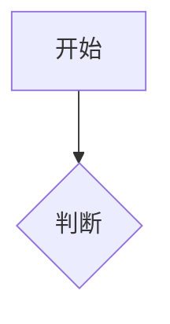

# Obsidian 语法速查（吸收自 kepano/obsidian-skills 官方规范）

写 vault 笔记时按本规范，保证 Obsidian 渲染正确。标准 Markdown（标题/粗斜体/列表/引用/代码块/表格）为常识，本文件只覆盖 **Obsidian 特有扩展**。

## 内部链接与外部链接的选择
- **vault 内笔记** → 一律用 `[[wikilink]]`（Obsidian 自动跟踪重命名）
- **外部 URL** → 用 `[text](url)` 标准链接
- 不要用 `[[]]` 包外链，也不要用 md 链接连内部笔记

## Frontmatter (Properties)

```yaml
---
title: 笔记标题
date: 2026-08-23
tags:
  - 主题
  - 状态
aliases:
  - 别名（链接建议里可搜到）
cssclasses:
  - custom-class
---
```
常用属性：`tags`（可检索标签）、`aliases`（别名，`[[别名]]` 也能跳转）、`cssclasses`（样式类）。

## Wikilinks（内部链接）

```markdown
[[笔记名]]                       链接到笔记
[[笔记名|显示文字]]              自定义显示文字
[[笔记名#标题]]                  链接到小节
[[笔记名#^块id]]                 链接到块（段落）
[[#同笔记内标题]]                本笔记内跳转
```
给段落定义块 ID（供 `^块id` 引用）：
```markdown
这段可以被块链接引用。^my-block
```
列表/引用块把块 ID 单独放一行：
```markdown
> 一段引用

^quote-id
```

## Embeds（嵌入）

wikilink 前加 `!` 即内联嵌入：
```markdown
![[笔记名]]                      嵌入整篇
![[笔记名#标题]]                 嵌入小节
![[image.png]]                   嵌入图片
![[image.png|300]]               按宽度嵌入
![[doc.pdf#page=3]]              嵌入 PDF 指定页
```

## Callouts（高亮块）

```markdown
> [!note]
> 基本提示。

> [!warning] 自定义标题
> 带标题的提示。

> [!faq]- 默认折叠
> 可折叠（- 折叠，+ 展开）。
```
常用类型：`note` `tip` `warning` `info` `example` `quote` `bug` `danger` `success` `failure` `question` `abstract` `todo`。

## 内联标签 / 注释 / 高亮

```markdown
#标签           行内标签（可 #嵌套/层级）
#nested/tag     层级标签

可见 %%隐藏%% 文本。       注释（阅读视图隐藏）
==高亮文字==               荧光高亮
```

## 数学 / 图表 / 脚注

```markdown
行内公式 $e^{i\pi}+1=0$

块公式：
$$
\frac{a}{b}=c
$$

mermaid 图：

（mermaid 节点可 `class Node internal-link;` 链到笔记）

脚注：正文[^1]。[^1]: 脚注内容。行内脚注。^[内联脚注]
```

## 完整示例

````markdown
---
title: 项目 Alpha
date: 2026-08-23
tags:
  - project
status: active
---

# 项目 Alpha

目标是 [[改进工作流]]。

> [!important] 关键节点
> 第一阶段截止 ==1月30日==。

## 任务
- [x] 初步规划
- [ ] 开发阶段

## 备注
算法复杂度 $O(n\log n)$，详见 [[算法笔记#排序]]。

![[架构图.png|600]]
````

## 扩展：Bases / Canvas / CLI（轻量）

- **Obsidian Bases（`.base`）**：YAML 数据库式视图（filters/formulas/views：table/cards/list/map），适合对一组笔记做表格/卡片视图。语法见 https://help.obsidian.md/bases/syntax
- **JSON Canvas（`.canvas`）**：JSON Canvas Spec 1.0 白板文件（`{"nodes":[],"edges":[]}`，节点 16 位 hex id），适合思维导图/流程图。见 https://jsoncanvas.org/spec/1.0/
- **Obsidian CLI（`obsidian`）**：需要 Obsidian 打开时，可用 CLI 增删查笔记/属性/插件开发（`obsidian help`）。见 https://help.obsidian.md/cli

> 本文件吸收自 https://github.com/kepano/obsidian-skills 的 obsidian-markdown 规范（MIT）。
